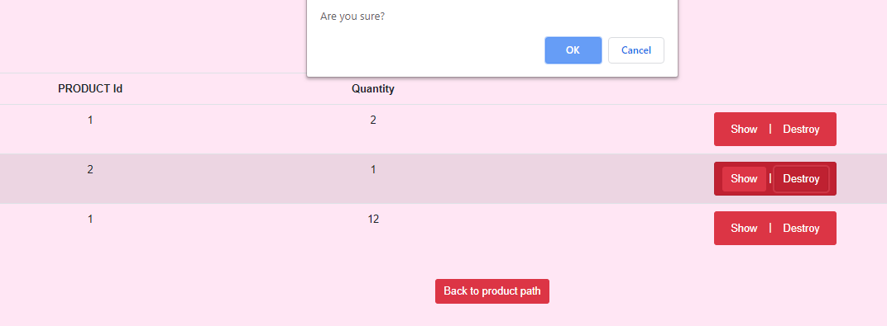

# About the E_commerce website

I created this full stack E-commerce website by using Ruby on Rails and MySQL for both sellers and buyers. 
Users have an ability to put there products to sell and manege it. Also they can view other users products and make an orders.
The user can only edite his own products and orders. 


# The features 
- User registration, login, logout.
- User can be seller & buyer.
- Detailed order & product show page.
- Product & category changes restricted to the owner only .
- When user add products in his card to make an order, it will be reduce from the stock.
- User can't order more than the budget that in stock.
- Heroku deployment


# List technologies used 
- Ruby on Rails 
- MySQL
- HTML
- CSS
- JQuery
- Java Script
- Git bash
- GitHub


# Future plan 
- Complete purchases from the site
- Payment by MasterCard or Paypal
- Tracking order


# Pictures for the website

- Registration page.

- All products for all users

- Product show page.

- Add to card page.. there are only 23 product in the stock.

- User order's page. It's will only appears to the specific user

- The user can delete his own order

- User can add a new product to sell

- User can manage his own products


# How i solved the card budget

```
 
  def create 
    product = Product.find(params[:order][:product_id])
    @order = Order.new(order_params) 
    @order.user_id = current_user.id
    add_quantity
    @order.save
    redirect_to orders_path
  end
  
    private
    def add_quantity
        product = Product.find(params[:order][:product_id])
        @product = @order.product  
        @product.stock -= @order.quantity
        @product.save
      end

```  


# This is the website link .. Have fun !
> https://e-commerce-doaa.herokuapp.com/products


 # By Doaa Turkistani 

